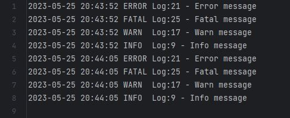
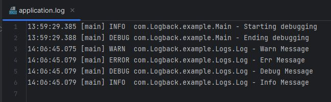

# Java Logging

## Loglama nedir?

- Loglama bir sistemin hareketlerini kaydeden yapıdır. Bir projede karşılaşılan hataları, akışları, performans sıkıntılarını ve son kullanıcının yaptığı işlemleri izleyerek, bunları anlık olarak yakalayıp düzeltmek için kullanılır.

1. Loglama sistematik olmalıdır.
2. Loglama Kontrol edilebilir olmalıdır.
3. Loglama bir uygulamanın durumunu açıklamalıdır.

- Loglamanın yanlış yapılması sistem performansını ve verimliliği düşürür. O yüzden loglanacak bilgilerin doğru kararlaştırılması gerekir

## Log4j Nedir?

- Apache tarafından geliştirilen loglama kütüphanesidir.
- Log4j kullanmak için log4j.jar dosyasında ve log4j tanımlarının yapıldığı properties dosyasına ihtiyaç bulunmaktadır. Bu properties dosyası standart olarak log4j.properties  yada log4j.xml dosyaları olabilir.
-Log4j, loglamayı seviye bazlı yapar bu seviye properties dosyasından ayarlanabilir. Seviye ne kadar düşükse, o kadar az log alır ve sistem kaynaklarını az kullanır.
-İstenilen formatta log kayıtları tutulabilir.(.txt, veritabanı, xml, html gibi).

### Log4j Yapılandırma Dosyası

Aşağıdaki yapılandırma dosyasına göre

- **log4j.rootLogger**, özelliği ile log düzeyi belirlenir.
- Çıktı, **./log/log.txt** dosyasına yazdırılır.
- Dosya boyutunu 10 MB'yı geçtiğinde 5 yedek dosya oluşturulur.
- Log satırının formatı **"%d{yyyy-MM-dd HH:mm:ss} %-5p %c{1}:%L - %m%n"**, **%d** tarih, **%p** log düzeyini, **%c{1}**class adını, **%L** satır numarasını, **%m%n** log mesajını temsil eder.

#### log4j.properties

```properties
# Log düzeylerini belirleyin: TRACE, DEBUG, INFO, WARN, ERROR, FATAL
# Root logger option
log4j.rootLogger=INFO,HTML, stdout, file
# Redirect log messages to console
log4j.appender.stdout=org.apache.log4j.ConsoleAppender
log4j.appender.stdout.Target=System.out
log4j.appender.stdout.layout=org.apache.log4j.PatternLayout
log4j.appender.stdout.layout.ConversionPattern=%d{yyyy-MM-dd HH:mm:ss} %-5p %c{1}:%L - %m%n
# Redirect log messages to a log file, support file rolling.
log4j.appender.file=org.apache.log4j.RollingFileAppender
log4j.appender.file.File=./log/log.txt 
log4j.appender.file.MaxFileSize=5MB
log4j.appender.file.MaxBackupIndex=10
log4j.appender.file.layout=org.apache.log4j.PatternLayout
log4j.appender.file.layout.ConversionPattern=%d{yyyy-MM-dd HH:mm:ss} %-5p %c{1}:%L - %m%n
log4j.appender.LOGFILE.Append=false
# Define the file appender
log4j.appender.HTML=org.apache.log4j.FileAppender
log4j.appender.HTML.File=./log/log.html
# Define the html layout for file appender
log4j.appender.HTML.layout=org.apache.log4j.HTMLLayout
log4j.appender.HTML.layout.Title=Application logs
log4j.appender.HTML.layout.LocationInfo=true
log4j.appender.HTML.Threshold=DEBUG
```

#### log4j.xml

```xml
<appender name="console" class="org.apache.log4j.ConsoleAppender">
    <layout class="org.apache.log4j.PatternLayout">
        <param name="ConversionPattern" value="%d{yyyy-MM-dd HH:mm:ss} %-5p %c{1}:%L - %m%n" />
    </layout>
</appender>

appender name="file" class="org.apache.log4j.RollingFileAppender">
    <param name="append" value="true" />
    <param name="maxFileSize" value="10MB" />
    <param name="maxBackupIndex" value="10" />
    <param name="file" value="log4jXml.txt" />
    <layout class="org.apache.log4j.PatternLayout">
    <param name="ConversionPattern" value="%d{yyyy-MM-dd HH:mm:ss} %-5p %c{1}:%L - %m%n" />
    </layout>
</appender>

<root>
    <level value="DEBUG" />
    <appender-ref ref="file" />
    <appender-ref ref="console" />
</root>
```

## Log.txt


<<<<<<< HEAD
=======

>>>>>>> d508a03d2dd4e6178c852899c79c6d233174a17a

## Logback nedir?

- Log4j, loglama ihtiyaçlarını karşılamada başarılı olsa da, performans ve yapılandırma açısından bazı sınırlamaları vardı. Logback, bu sınırlamaları aşmak ve daha gelişmiş özellikler sunmak amacıyla tasarlanmıştır.

- Logback, üç ana bileşenden oluşur: Logger, Appender ve Layout.

1. Logger, log verilerini oluşturmak ve yönlendirmek için kullanılır.
2. Appender, log verilerini çeşitli hedeflere (dosya, konsol, uzak sunucu vb.) yazmak için kullanılır.
3. Layout, log verilerinin nasıl biçimlendirileceğini belirler.

### Logback Yapılandırma Dosyası

- Bu yapılandırma dosyası, log verilerini konsol üzerinde görüntülerken aynı zamanda logs/application.log adlı bir dosyaya da yazacaktır.

- Yapılandırmada CONSOLE ve FILE adında iki appender tanımlanmıştır. Her ikisinin de formatı aynıdır ve %d{HH:mm:ss.SSS} [%thread] %-5level %logger{36} - %msg%n deseni kullanılmıştır.

    ```xml
    <configuration>

      <!-- Konsol üzerinde log çıktısını gösterir -->
      <appender name="CONSOLE" class="ch.qos.logback.core.ConsoleAppender">
        <encoder>
          <pattern>%d{HH:mm:ss.SSS} [%thread] %-5level %logger{36} - %msg%n</pattern>
        </encoder>
      </appender>

      <!-- Dosyaya log çıktısını yazmak için -->
      <appender name="FILE" class="ch.qos.logback.core.FileAppender">
        <file>logs/application.log</file>
        <encoder>
          <pattern>%d{HH:mm:ss.SSS} [%thread] %-5level %logger{36} - %msg%n</pattern>
        </encoder>
      </appender>

      <!-- Root logger -->
      <root level="debug">
        <appender-ref ref="CONSOLE" />
        <appender-ref ref="FILE" />
      </root>

    </configuration>
    ```

## application.log


